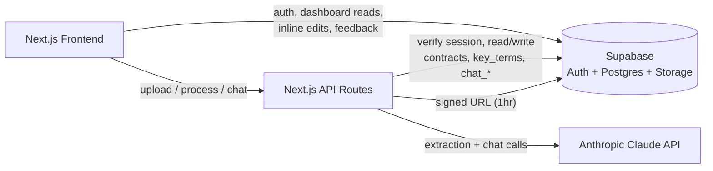
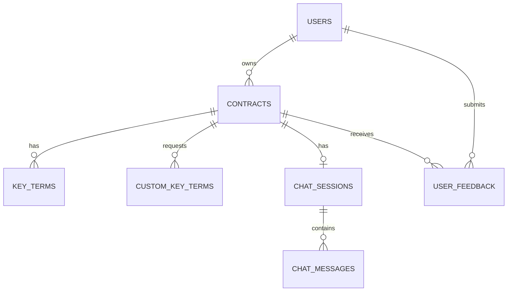

# ContractIQ — Engineering Document

**Stage:** 1 — Engineering Plan
**Source:** `docs/ContractIQ_PRD.md` (v1.0, June 24, 2026)
**Status:** Draft — awaiting approval
**Frontend (fixed):** Next.js 14, App Router

> **Provider note:** The PRD is written around OpenAI GPT-4o. Per project decision, ContractIQ uses **Anthropic Claude** as its LLM provider instead (see `README.md`). Every AI-related section below reflects that substitution — model, structured-output mechanism, and cost math have been remapped. All other PRD decisions (Supabase, Next.js, contract-type scope, guardrail strategy) carry over unchanged.

---

## Table of Contents

1. [Executive Summary](#1-executive-summary)
2. [Product Scope](#2-product-scope)
3. [User Personas](#3-user-personas)
4. [User Flows](#4-user-flows)
5. [Frontend Architecture](#5-frontend-architecture)
6. [Backend Architecture](#6-backend-architecture)
7. [Database Design and Schema](#7-database-design-and-schema)
8. [AI Architecture](#8-ai-architecture)
9. [API Specification](#9-api-specification)
10. [Feature Breakdown](#10-feature-breakdown)
11. [Folder Structure](#11-folder-structure)
12. [Naming Conventions](#12-naming-conventions)
13. [Testing Strategy](#13-testing-strategy)
14. [Specs to Implementation Mapping](#14-specs-to-implementation-mapping)

---

## 1. Executive Summary

**Project:** ContractIQ — an AI-assisted contract review tool for Non-Disclosure Agreements (NDA) and Master Service Agreements (MSA).

**Business goal:** Give SMB founders, operations leads, procurement managers, and freelancers — none of whom have in-house legal counsel — a way to understand exactly what they're signing without a $250–$500/hr lawyer, and without the 90–120 minutes it currently takes to review a contract manually.

**Problem statement:** Clause phrasing varies enormously across law firms and jurisdictions, so rule-based parsing misses obligations at a >30% rate. Generic AI chat tools (ChatGPT) produce unstructured summaries with no page reference, no confidence score, and no way to verify a claim against the source text. ContractIQ closes this gap with a purpose-built extraction schema per contract type, page-level attribution, self-reported confidence per term, and a chat interface that is contractually forbidden from answering outside the uploaded document.

**Target users:**
- **Primary:** Time-pressed founders / ops leads at 5–250 person companies who sign 5–15 NDAs/MSAs per month.
- **Secondary:** Freelancers/consultants who receive 1–4 client MSAs per month and can't afford ad-hoc legal review.

**Success criteria (from PRD §3):**

| Metric | Target |
|---|---|
| Time from upload → completed review | ≤ 15 minutes (baseline: 90 min manual) |
| Key-term extraction F1 | ≥ 88% (NDA), ≥ 85% (MSA) |
| Time to first extracted term displayed | ≤ 30s P95 (≤ 20-page contracts) |
| Chat response latency | ≤ 15s P95 |
| Cost per contract analysis | ≤ $0.25 (extraction target ≤ $0.20) |
| Chat hallucination rate | ≤ 5% (monthly expert review of 50 Q&A pairs) |
| Confidence calibration error | ≤ 0.10 per 10%-bucket |

**MVP boundary:** English-language, text-layer (non-scanned) PDFs, ≤ 20 pages / ≤ 10 MB / ≤ 15,000 tokens, NDA and MSA contract types only, US/UK legal conventions.

---

## 2. Product Scope

### In Scope (MVP, v0.1–v1.0)

- Email/password authentication (Supabase Auth)
- PDF upload with contract-type selection (NDA / MSA), size/page/token validation
- Server-side text extraction with `[PAGE N]` markers, stored once in the database
- Standard key-term extraction per contract type (10 terms for NDA, 12 for MSA — PRD §4)
- Up to 5 user-defined custom key terms per contract, extracted with the same schema as standard terms
- Confidence score (0–100%) per term, colour-coded (green ≥ 80, amber 50–79, red < 50) with a non-dismissible low-confidence warning
- Page-number attribution per term, with click-to-navigate into the document viewer
- Expandable "Why?" section showing the verbatim `source_sentence` per term
- Interactive PDF viewer (PDF.js) as the primary contract view, with a **paginated text-viewer fallback** when Supabase Storage is unavailable (FR-06)
- Inline correction of any extracted term (original AI value preserved for the feedback loop)
- Contract chat: full-document-grounded Q&A, mandatory `[Page X]` citation, persistent history per contract
- Dashboard: total contracts, breakdown by type, sortable history list
- Thumbs-up/down feedback with optional comment (P2)
- "Not legal advice" disclaimer on every results page
- Row-Level Security on every table; 90-day PDF retention with auto-delete; user-initiated full deletion

### Out of Scope (MVP)

- Scanned/image PDFs (OCR) — graceful rejection only ("Scanned PDFs are not supported yet")
- Non-English contracts, non-US/UK legal conventions
- Contract types other than NDA and MSA
- CSV/PDF export of results (P2/backlog — deferred to v1.1)
- Batch upload, multi-user/team workspaces, contract-to-contract comparison
- Any AI action that modifies or signs the contract — the system only answers questions, never takes action

### Future Enhancements (post-v1.0, per PRD roadmap)

| Release | Adds |
|---|---|
| v1.1 | CSV export, PDF summary export, batch upload (≤5 contracts), dashboard analytics charts |
| v1.2 | OCR for scanned PDFs, side-by-side contract comparison, email notifications, team workspaces (multi-seat) |

---

## 3. User Personas

| Persona | Role / Company | Behaviour | Core Pain | Permissions |
|---|---|---|---|---|
| **Time-Pressed Founder / Ops Lead** (primary) | Founder, COO, Procurement Manager, Legal Ops — SaaS/agency/fintech/e-commerce, 5–250 employees, no in-house legal | Signs 5–15 NDAs/MSAs/month; relies on Google or ad-hoc paid legal review | 90–120 min per contract; misses auto-renewal, indemnification limits, IP assignment clauses | Standard authenticated user — full access to own contracts only |
| **Freelancer / Consultant** (secondary) | Individual contributor — design, marketing, dev, consulting | Receives 1–4 client MSAs/month; signs without full review due to power imbalance with larger clients | Can't afford legal review; no way to spot non-standard/risky clauses | Standard authenticated user — full access to own contracts only |

**MVP role model:** single flat role. Every authenticated user has full CRUD over their own `contracts`, `key_terms`, `chat_sessions`, and `user_feedback` rows, enforced entirely by RLS on `user_id`. No admin, moderator, or team-shared role exists in the MVP — multi-seat "Pro" workspaces are explicitly a v1.2 feature and out of scope here.

---

## 4. User Flows

Format: `User Action → Frontend Behavior → Backend Processing → Database Interaction → System Response`

### Flow 1 — New Visitor Sign-Up

```
User clicks "Get Started Free" on landing page
  → Frontend opens Supabase Auth sign-up modal (email + password)
  → Backend: Supabase Auth creates the user record, sends verification email
  → DB: row created in auth.users (Supabase-managed)
  → System redirects to Dashboard; empty state: "No contracts reviewed yet — upload your first contract to begin"
```

### Flow 2 — Returning User → Dashboard

```
User signs in
  → Frontend: Supabase Auth session established, client-side fetch of dashboard data
  → Backend: none (direct Supabase client query, RLS-scoped to auth.uid())
  → DB: SELECT aggregate counts + last 5 contracts FROM contracts WHERE user_id = auth.uid()
  → System renders summary card (total contracts, breakdown by NDA/MSA) + "Review a Contract" CTA
```

### Flow 3 — Core Flow: Contract Review (Upload → Extract → Results)

```
1. User selects contract type (NDA/MSA), drags/picks a PDF
   → Frontend validates client-side (file type, ≤10MB) before submit

2. User submits upload
   → Frontend: POST /api/contracts/upload (multipart)
   → Backend: validates size/type again server-side; runs pdf-parse; inserts [PAGE N]
     markers; rejects if page count > 20 or extracted word count < 100 (scanned-PDF
     signal); estimates token count, rejects if > 15,000; uploads original PDF to
     Supabase Storage (non-blocking — failure only means file_path stays null)
   → DB: INSERT INTO contracts (status='uploaded', contract_text, file_path?);
     INSERT INTO custom_key_terms for any user-added terms
   → System shows the pre-processing preview: the standard term list for the selected
     type, plus any custom terms with a "Custom" badge

3. User clicks "Process Contract"
   → Frontend: POST /api/contracts/[id]/process; shows 3-step progress indicator
     (extracting text → analysing with AI → compiling results)
   → Backend: reads contract_text from DB (never re-reads the file); builds the
     extraction prompt (contract type + standard schema + custom terms); calls
     Claude with forced tool-use for structured JSON; retries up to 3x with
     exponential backoff on failure
   → DB: UPDATE contracts SET status='processing' → 'completed'|'error';
     INSERT INTO key_terms (one row per extracted term, standard + custom)
   → System renders the two-panel Results page

4. Results page interaction
   → User clicks a term's page number → Frontend scrolls PDF viewer (or text-viewer
     fallback) to that page, highlights the nearest matching span
   → User edits a term inline → Frontend: direct Supabase client UPDATE (RLS-scoped)
     on key_terms.current_value; is_edited=true, edited_at=now(); ai_value untouched
   → DB: row updated within the 2s SLA
   → System shows an "Edited" badge on the corrected term
```

### Flow 4 — Chat with Contract

```
User opens the "Chat" tab/floating button on the Results page
  → User types a question (e.g. "What happens if I breach the NDA?")
  → Frontend: POST /api/chat/[contractId]/messages { message }
  → Backend: fetches contract_text + full message history (ascending, ≤200 msgs)
    from DB; classifies the query (contract / history / both); builds a system
    prompt instructing "answer only from the document text provided; if the answer
    is not present, say so"; calls Claude at temperature 0.4; enforces a mandatory
    [Page X] citation in the response (or "I cannot find this in the document")
  → DB: INSERT INTO chat_messages (role='user', content=question);
    INSERT INTO chat_messages (role='assistant', content=response, page_citation)
  → System renders the exchange (user right-aligned, assistant left-aligned) with
    the citation as a clickable link back to the PDF viewer page
```

---

## 5. Frontend Architecture

### Stack

- **Framework:** Next.js 14, App Router, React Server Components where read-only (dashboard shell, landing page) and Client Components for anything interactive (upload, PDF viewer, chat, inline edit)
- **Styling:** Tailwind CSS, tokens sourced from `docs/design.md` (Inter Display typeface, 4px spacing grid, semantic color tokens — see `/design-system` skill, applied to all UI work)
- **PDF rendering:** PDF.js (client-side, lazy page loading) as primary viewer; a custom text-viewer component parses `[PAGE N]` markers from `contract_text` as the fallback when `file_path` is null or the signed URL fails
- **State management:** No global store required at MVP scope. Server data (contract, key terms, chat history) is fetched per-page via the Supabase client (React Server Component + client hydration) or `fetch` to API routes; local component state (`useState`/`useReducer`) handles UI-only concerns (active tab, modal open/closed, inline-edit draft value). Chat message list uses optimistic local state updated on each API response.
- **Data fetching:** Supabase JS client for direct table reads/writes (RLS-protected); native `fetch` to Next.js API routes for the three AI/heavy-processing operations (upload, process, chat)

### Page / Component Hierarchy

```
app/
├── (marketing)/page.tsx                 — Landing page (static)
├── (auth)/sign-in, sign-up              — Supabase Auth UI
├── (dashboard)/dashboard/page.tsx       — Summary card + sortable contract list
├── (dashboard)/contracts/new/page.tsx   — Upload screen + pre-processing preview
└── (dashboard)/contracts/[id]/page.tsx  — Results page
    ├── <PdfViewer />  or  <TextViewerFallback />   (left panel)
    ├── <KeyTermsPanel />                            (right panel)
    │    └── <KeyTermRow /> × N  (value, page, confidence badge, "Why?" expander, inline edit)
    └── <ChatPanel />                                 (tab or floating overlay)
         ├── <ChatMessageList />
         └── <ChatInput />
```

### UX States

| State | Handling |
|---|---|
| Loading | Skeleton rows for dashboard list; 3-step progress indicator during processing (extract → analyse → compile) |
| Empty | Dashboard empty state on zero contracts; "No custom terms added" placeholder on upload screen |
| Error | Scanned-PDF rejection message; file-too-large/too-many-pages message; AI-provider timeout with "Try again in a few minutes" CTA and retry button (no silent failures) |
| Low confidence | Non-dismissible ⚠️ tooltip on any term < 50%; PDF viewer auto-highlights nearest matching page span |
| Responsive | Two-panel Results layout collapses to a tabbed single-column layout below `768px`; PDF viewer supports pinch/zoom on mobile |
| Accessibility | WCAG 2.1 AA — all interactive elements keyboard-navigable, confidence colour is paired with icon + text (not colour alone), focus rings per `docs/design.md` motion spec |

---

## 6. Backend Architecture

### Stack

Next.js 14 API Routes (`app/api/**/route.ts`) act as a **thin orchestration layer** — no business logic beyond: validate input → call Supabase and/or Claude → shape the response. Per the PRD's architecture note, the backend is only invoked for operations that are AI-heavy or require server-only work (file parsing, API keys); everything else is a direct Supabase client call from the frontend, protected by RLS.

### Core Systems

- **Auth:** Delegated entirely to Supabase Auth. API routes verify the caller's session via the Supabase server client (`createServerClient` reading the auth cookie) and reject with `401` if absent.
- **Authorization:** Every API route re-checks resource ownership (`contract.user_id === session.user.id`) in addition to RLS — defense in depth, since API routes use a request-scoped Supabase client bound to the caller's JWT, not the service role key.
- **PDF text extraction (Component B):** `pdf-parse` runs once, at upload time, inside `POST /api/contracts/upload`. Output is normalized into `[PAGE N]` markers and written to `contracts.contract_text`. No other route ever re-parses or re-downloads the PDF — the process and chat routes read exclusively from the stored text column.
- **Key term extraction (Component C):** `POST /api/contracts/[id]/process` reads `contract_text`, builds the extraction prompt (see §8), calls Claude, validates the returned JSON against the term schema, and writes `key_terms` rows.
- **Contract chat (Component F):** `POST /api/chat/[contractId]/messages` reads `contract_text` + message history, calls Claude, persists both turns.
- **Validation:** Zod schemas for every route's request body; file MIME/size checks before any parsing work begins.
- **Error handling:** Centralized error-response helper returns `{ error: { code, message } }`; Claude calls wrapped in a 3-attempt exponential-backoff retry (per PRD external-dependency mitigation); on final failure, `contracts.status` is set to `'error'` with `error_message` populated so the user can retry without re-uploading.
- **Middleware:** `middleware.ts` enforces authenticated-only access to `/dashboard/*` and `/api/*` (redirects unauthenticated requests to `/sign-in`).

### Service Interaction Diagram



---

## 7. Database Design and Schema

Single Supabase project. All application tables carry a `user_id` (directly, or transitively via `contract_id`) so Row-Level Security can scope every row to `auth.uid()`. Full paste-and-run SQL (tables, RLS policies, indexes, triggers, storage bucket policies) is produced in Stage 2 by the `implementation-specs` skill — this section defines the schema those SQL statements must implement.

### `contracts`

| Column | Type | Notes |
|---|---|---|
| `id` | `uuid` PK, default `gen_random_uuid()` | |
| `user_id` | `uuid` FK → `auth.users(id)` | not null |
| `name` | `text` | original filename |
| `contract_type` | `text` | `check in ('NDA','MSA')` |
| `file_path` | `text` | nullable — Storage path `contracts/{user_id}/{contract_id}/{filename}.pdf`; null if Storage upload failed |
| `contract_text` | `text` | extracted text with `[PAGE N]` markers; not null after upload succeeds |
| `page_count` | `int` | |
| `status` | `text` | `check in ('uploaded','processing','completed','error')`, default `'uploaded'` |
| `error_message` | `text` | nullable |
| `last_accessed_at` | `timestamptz` | default `now()`; drives the 90-day retention job |
| `created_at` / `updated_at` | `timestamptz` | default `now()`; `updated_at` auto-updated by trigger |

Indexes: `(user_id)`, `(user_id, status)`.

### `key_terms`

Holds **every** extracted term — standard and custom alike — for a contract.

| Column | Type | Notes |
|---|---|---|
| `id` | `uuid` PK | |
| `contract_id` | `uuid` FK → `contracts(id)` on delete cascade | |
| `term_name` | `text` | e.g. "Governing Law" |
| `ai_value` | `text` | original, immutable extraction |
| `current_value` | `text` | defaults to `ai_value`; overwritten on user edit |
| `page_number` | `int` | 1-indexed |
| `confidence_score` | `numeric(5,2)` | `check (confidence_score between 0 and 100)` |
| `source_sentence` | `text` | verbatim sentence backing the extraction |
| `is_custom` | `boolean` | default `false` — true if sourced from `custom_key_terms` |
| `is_edited` | `boolean` | default `false` |
| `edited_at` | `timestamptz` | nullable |
| `created_at` | `timestamptz` | default `now()` |

Indexes: `(contract_id)`.

### `custom_key_terms`

The user's pre-processing request for extra terms (input, not output). Merged into the extraction prompt; results land in `key_terms` with `is_custom = true`.

| Column | Type | Notes |
|---|---|---|
| `id` | `uuid` PK | |
| `contract_id` | `uuid` FK → `contracts(id)` on delete cascade | |
| `term_name` | `text` | user-typed, e.g. "Non-compete radius" |
| `created_at` | `timestamptz` | default `now()` |

Constraint: max 5 rows per `contract_id` (enforced at the API layer at insert time).
Indexes: `(contract_id)`.

### `chat_sessions`

| Column | Type | Notes |
|---|---|---|
| `id` | `uuid` PK | |
| `contract_id` | `uuid` FK → `contracts(id)` on delete cascade | |
| `user_id` | `uuid` FK → `auth.users(id)` | |
| `created_at` / `updated_at` | `timestamptz` | |

One session per contract at MVP (created lazily on first chat message). Indexes: `(contract_id)`, `(user_id)`.

### `chat_messages`

| Column | Type | Notes |
|---|---|---|
| `id` | `uuid` PK | |
| `session_id` | `uuid` FK → `chat_sessions(id)` on delete cascade | |
| `role` | `text` | `check in ('user','assistant')` |
| `content` | `text` | not null |
| `page_citation` | `int` | nullable — parsed `[Page X]` from assistant responses |
| `created_at` | `timestamptz` | default `now()` |

Indexes: `(session_id, created_at)` — supports fetching the ascending, ≤200-message history efficiently.

### `user_feedback`

| Column | Type | Notes |
|---|---|---|
| `id` | `uuid` PK | |
| `user_id` | `uuid` FK → `auth.users(id)` | |
| `contract_id` | `uuid` FK → `contracts(id)` on delete cascade | |
| `rating` | `text` | `check in ('up','down')` |
| `comment` | `text` | nullable |
| `created_at` | `timestamptz` | default `now()` |

Indexes: `(contract_id)`.

### `term_corrections` (view)

A `VIEW` (not a table) over `key_terms WHERE is_edited = true`, exposing `contract_id`, `term_name`, `ai_value`, `current_value`, `edited_at` — feeds the weekly correction-rate monitoring and the ≤12%-in-7-days prompt-review trigger described in the PRD's prompt-improvement plan.

### Entity Relationships



### Storage

Bucket: `contracts`. Path convention: `contracts/{user_id}/{contract_id}/{filename}.pdf`. Signed URLs issued with a **1-hour expiry** for the PDF viewer. RLS on `storage.objects` restricts INSERT/SELECT/DELETE to `auth.uid()::text = (storage.foldername(name))[1]`. Upload is non-blocking — a Storage failure leaves `file_path = null` and only disables the interactive viewer; the text-viewer fallback (reading `contract_text`) always works.

### RLS Policy Design (implemented as SQL in Stage 2)

- `contracts`: `user_id = auth.uid()` for all operations
- `key_terms`, `custom_key_terms`: scoped via `EXISTS (SELECT 1 FROM contracts WHERE contracts.id = key_terms.contract_id AND contracts.user_id = auth.uid())`
- `chat_sessions`: `user_id = auth.uid()`
- `chat_messages`: scoped via join through `chat_sessions.user_id = auth.uid()`
- `user_feedback`: `user_id = auth.uid()`

---

## 8. AI Architecture

### Provider & Model

| Criteria | Requirement | Rationale |
|---|---|---|
| Provider | **Anthropic Claude** (project decision, overriding the PRD's OpenAI default) | Consistent with the project's fixed AI stack |
| Model | Claude Sonnet | Best cost/performance balance for long legal-text reasoning; strong structured-output support via tool-use |
| Context window | 200k tokens (model default) | Comfortably exceeds the PRD's ≥128k requirement; a 15,000-token contract + prompt + chat history fits with large headroom |
| Structured output | Forced tool-use — a single tool definition mirrors the term-extraction JSON schema (`term_name`, `value`, `page_number`, `confidence_score`, `source_sentence`), called with `tool_choice: {type: "tool", name: "extract_key_terms"}` so the model *must* return schema-conformant arguments | Claude has no bare "JSON mode" equivalent to OpenAI's `response_format`; forced tool-use is the standard mechanism for guaranteed-parseable structured output and serves the same purpose the PRD assigns to JSON mode |
| Max tokens per call | 2,000 output — extraction; 1,000 output — chat | Bounded extraction output; concise chat answers |
| Temperature | 0.1 — extraction; 0.4 — chat | Deterministic structured extraction vs. natural conversational tone |
| Latency budget | ≤ 20s P95 per call | Combined with UI loader, total experience target stays ≤ 30s |

### Cost Model (remapped from the PRD's OpenAI numbers)

Assuming a 20-page contract ≈ 15,000 input tokens + 1,500 output tokens, at Claude Sonnet pricing (~$3 / 1M input tokens, ~$15 / 1M output tokens):

| Component | Calculation | Cost |
|---|---|---|
| Input | 15,000 tokens × $0.000003 | $0.045 |
| Output | 1,500 tokens × $0.000015 | $0.0225 |
| **Total per extraction** | | **≈ $0.068** |

This is well under the PRD's $0.20 extraction budget and $0.25 total-per-analysis budget (the PRD's own GPT-4o estimate was ~$0.097) — the Claude switch improves margin. Chat calls are cheaper still (smaller output cap, though input grows with conversation history up to the same 15,000-token document + up to 200 prior messages). Monitor actual usage via the Anthropic Console/usage API monthly; alert at 80% of the per-analysis budget, per the PRD's cost-risk mitigation.

### Prompt Strategy

| Task | Technique | Output | Notes |
|---|---|---|---|
| Key term extraction | Few-shot (3 labelled NDA examples, 3 MSA examples embedded in the system prompt) + forced tool-use | Tool-call arguments: array of `{term_name, value, page_number, confidence_score, source_sentence}` | Few-shot grounds the model on clause-variant diversity across law firms/geographies |
| Confidence scoring | Self-reported within the same extraction call (no second inference) | Float 0–100 per term | Model reasons about certainty while extracting — avoids doubling cost/latency |
| Custom term extraction | Zero-shot — term name(s) from `custom_key_terms` appended to the standard schema's target list for that contract | Same tool schema, `is_custom` flag set app-side on write | Up to 5 custom terms per contract (context-length ceiling) |
| Contract chat | Full-context RAG-style — entire `contract_text` + full ascending message history (up to 200 messages) passed every turn; system prompt: *"Answer only from the document text provided. If the answer is not in the document, say so."* | Free text with mandatory `[Page X]` citation, prefixed "Based on the document…" | No chunking/vector retrieval at MVP — contracts are ≤15,000 tokens, so full context guarantees no clause is missed by retrieval error |
| Query classification | Lightweight classification (`contract` / `history` / `both`) folded into the same system-prompt construction step — no extra API call | Adjusts which context sections are emphasized | Enables memory-style questions ("what did you say earlier about X?") without added latency/cost |
| Error recovery | If tool-use parsing fails, one automatic retry with an explicit instruction to conform to the schema | Same tool schema | Single retry before surfacing an error to the user |

### Grounding & Hallucination Guardrails

- **Single source of truth:** text is extracted once at upload; extraction and chat both read only the stored `contract_text` — the model never sees anything the user didn't upload.
- **Source-sentence requirement:** every extracted term must include a verbatim `source_sentence`; a term returned without one is treated as unreliable and flagged.
- **Mandatory citation:** every chat response must carry a `[Page X]` tag; the API route validates this pattern is present before persisting/returning the message.
- **"Not found" is a valid answer:** chat system prompt explicitly instructs "I cannot find this in the document" when information is absent — this is a pass, not a failure, in eval.
- **Deterministic extraction:** temperature 0.1 minimizes fabrication and schema drift.
- **Calibration monitoring:** monthly job compares predicted confidence buckets (10% intervals) against `term_corrections` outcomes; UI shows a calibration warning banner if miscalibration ≥ 15%.
- **Automated regression test:** feed a question about a topic absent from a known test document; assert the response is the "cannot find this" fallback (CI-gated, per PRD internal-risk mitigation).

### Rate Limiting

Per-user rate limit on `/api/contracts/[id]/process` and `/api/chat/[contractId]/messages` (token-bucket, e.g. 10 AI calls/minute/user) to protect the cost budget and the 100-concurrent-analysis scalability target — implemented in Stage 3 (security-foundation).

---

## 9. API Specification

Per §6, only AI-heavy or server-only operations get a custom Next.js API route. Auth, dashboard reads, key-term listing, inline term edits, and feedback submission are **direct Supabase client calls protected by RLS** — documented here for completeness but not as custom endpoints.

### `POST /api/contracts/upload`

- **Auth:** required
- **Request:** `multipart/form-data` — `file` (PDF, ≤10MB), `contract_type` (`'NDA'|'MSA'`), `custom_terms` (string[], optional, ≤5 entries)
- **Processing:** validates size/type; runs `pdf-parse`; rejects if page count > 20, extracted word count < 100 (scanned-PDF signal), or estimated tokens > 15,000; uploads to Storage (non-blocking)
- **Response `201`:** `{ contract_id, status: 'uploaded', standard_terms_preview: string[], custom_terms: string[] }`
- **Errors:** `400` invalid file type/size/missing contract_type · `422` scanned PDF detected or token limit exceeded · `500` unexpected extraction failure

### `POST /api/contracts/[id]/process`

- **Auth:** required; ownership check (`contracts.user_id === session.user.id`)
- **Request:** no body — reads `contract_text`, `contract_type`, and associated `custom_key_terms` from the DB
- **Processing:** builds extraction prompt, calls Claude with forced tool-use, retries 3x with exponential backoff on failure, writes `key_terms`
- **Response `200`:** `{ contract_id, status: 'completed', key_terms: KeyTerm[] }`
- **Errors:** `404` not found · `403` not owner · `409` already processing · `413` token limit exceeded · `502` AI provider error after all retries (contract `status` set to `'error'`, `error_message` populated)

### `GET /api/chat/[contractId]/messages`

- **Auth:** required; ownership check
- **Processing:** lazily creates a `chat_sessions` row if none exists for the contract
- **Response `200`:** `{ session_id, messages: ChatMessage[] }` (ascending, ≤200)
- **Errors:** `404`, `403`

### `POST /api/chat/[contractId]/messages`

- **Auth:** required; ownership check
- **Request:** `{ message: string }`
- **Processing:** fetches `contract_text` + full history, classifies query type, calls Claude at temperature 0.4, validates `[Page X]` citation is present, persists both the user and assistant turns
- **Response `200`:** `{ message: string, page_citation: number | null, created_at: string }`
- **Errors:** `404`, `403`, `400` empty message, `502` AI provider error after retries (surfaced as a chat-bubble error state, not silent)

### Direct Supabase client operations (RLS-enforced, no custom route)

| Operation | Table(s) | Notes |
|---|---|---|
| Dashboard summary + sortable history | `contracts` | `SELECT ... WHERE user_id = auth.uid()`, aggregate + sort client-specified |
| Key terms panel read | `key_terms`, `custom_key_terms` | joined via `contract_id`, RLS via `contracts` ownership |
| Inline term correction | `key_terms` | `UPDATE current_value, is_edited, edited_at WHERE id = ...` — RLS via `contracts` ownership; must complete within 2s |
| Feedback submission | `user_feedback` | `INSERT` — `user_id = auth.uid()` enforced by RLS |
| Signed URL fetch for PDF viewer | Storage API | 1-hour expiry, via Supabase Storage client |

---

## 10. Feature Breakdown

Mapped directly to the PRD's own release roadmap (§3), with acceptance criteria pulled from the corresponding FR/US IDs.

### Phase 1 — Foundation (PRD v0.1)

- Supabase project + all tables provisioned
- Static landing page
- Email/password auth (US-001) — auth flow ≤10s, clear error on invalid credentials
- Empty dashboard state
- **Dependency:** none — this phase has no external blockers

### Phase 2 — Core Review Flow (PRD v0.2)

- PDF upload with contract-type selector, size/page/token validation (FR-02, FR-03)
- Server-side text extraction with `[PAGE N]` markers (FR-03)
- Claude key-term extraction, standard NDA + MSA schemas (US-002)
- Key terms panel: name, value, page, confidence (FR-04, US-003, US-004)
- Confidence colour-coding + low-confidence warning (FR-11)
- **Dependency:** Anthropic API access confirmed before this phase ships

### Phase 3 — Enriched Experience (PRD v0.3)

- Pre-processing preview of terms to be extracted
- Custom key term addition, ≤5 terms (FR-05, US-005)
- Interactive PDF viewer + text-viewer fallback (FR-06, FR-07, US-006)
- Click-to-navigate from key term to page
- Expandable "Why?" source-sentence tooltip
- **Dependency:** Phase 2 extraction pipeline stable

### Phase 4 — Chat & History (PRD v0.4)

- Contract chat with full-document grounding (FR-08, US-007)
- Persistent chat history (FR-09, US-012)
- Dashboard populated with sortable contract history (FR-10, US-008)
- Inline key term editing with "Edited" badge (US-009)
- Error states for upload failures and AI-provider timeouts
- **Dependency:** Phase 3 viewer must support citation-driven page navigation

### Phase 5 — Launch (PRD v1.0)

- Feedback submission — thumbs up/down + comment (FR-12, US-010)
- End-to-end performance optimisation to ≤30s P95
- Security audit: RLS verification, signed-URL expiry, API key handling (Stage 3 — `security-foundation`)
- WCAG 2.1 AA review
- Rate limiting on AI calls
- Onboarding tooltips for first-time users
- **Dependency:** Supabase Pro plan provisioned; DPA confirmed before public/EU launch

### Deferred (post-v1.0, not built in this workflow's MVP scope)

CSV/PDF export (US-011), batch upload, dashboard analytics charts, OCR support, contract comparison, multi-seat workspaces.

---

## 11. Folder Structure

```
contractiq/
├── app/
│   ├── (marketing)/
│   │   └── page.tsx                      — Landing page
│   ├── (auth)/
│   │   ├── sign-in/page.tsx
│   │   └── sign-up/page.tsx
│   ├── (dashboard)/
│   │   ├── dashboard/page.tsx             — Summary + history list
│   │   └── contracts/
│   │       ├── new/page.tsx               — Upload + pre-processing preview
│   │       └── [id]/page.tsx              — Results (viewer + terms + chat)
│   └── api/
│       ├── contracts/
│       │   ├── upload/route.ts
│       │   └── [id]/process/route.ts
│       └── chat/
│           └── [contractId]/messages/route.ts
├── components/
│   ├── upload/                            — UploadDropzone, ContractTypeSelect, CustomTermInput
│   ├── results/                           — PdfViewer, TextViewerFallback, KeyTermsPanel, KeyTermRow
│   ├── chat/                              — ChatPanel, ChatMessageList, ChatInput
│   ├── dashboard/                         — SummaryCard, ContractHistoryTable
│   └── ui/                                — Design-system primitives (Button, Badge, Tooltip, ConfidenceBadge)
├── lib/
│   ├── supabase/
│   │   ├── client.ts                      — browser client
│   │   └── server.ts                      — server/route-handler client
│   ├── claude/
│   │   ├── client.ts                      — Anthropic SDK wrapper
│   │   ├── extraction-prompt.ts           — NDA/MSA schema + few-shot examples
│   │   └── chat-prompt.ts                 — system prompt + query classification
│   ├── pdf/
│   │   └── extract-text.ts                — pdf-parse wrapper, [PAGE N] marker insertion
│   └── validation/
│       └── schemas.ts                     — Zod request schemas
├── types/
│   ├── contract.ts
│   ├── key-term.ts
│   └── chat.ts
├── docs/
│   ├── ContractIQ_PRD.md
│   ├── design.md
│   ├── engineering/
│   │   └── engineering-doc.md             — this file
│   └── specs/                             — generated in Stage 2
├── middleware.ts                          — auth gate on /dashboard, /api
├── .env.example
└── package.json
```

---

## 12. Naming Conventions

| Category | Convention | Example |
|---|---|---|
| Files (components) | PascalCase | `KeyTermsPanel.tsx` |
| Files (utilities/routes) | kebab-case | `extract-text.ts`, `route.ts` |
| React components | PascalCase | `<ConfidenceBadge />` |
| Hooks | `use` prefix, camelCase | `useChatSession()` |
| API routes | REST, plural nouns, path params for IDs | `/api/contracts/[id]/process` |
| DB tables | snake_case, plural | `key_terms`, `chat_sessions` |
| DB columns | snake_case | `contract_id`, `confidence_score` |
| Env vars | SCREAMING_SNAKE, service-prefixed | `ANTHROPIC_API_KEY`, `NEXT_PUBLIC_SUPABASE_URL` |
| Config files | lowercase, tool-standard | `next.config.mjs`, `tailwind.config.ts` |
| Route groups | parenthesized, non-URL-affecting | `(dashboard)`, `(auth)` |

---

## 13. Testing Strategy

| Layer | Scope | Framework | Coverage Target |
|---|---|---|---|
| Unit | Extraction JSON/tool-schema validation, confidence→colour mapping, token-length estimator, `[PAGE N]` marker parser | Vitest | ≥ 80% on `lib/` |
| Integration | API routes against a disposable test Supabase project — upload validation, process-route retry/backoff, chat route citation enforcement; RLS cross-user isolation (attempt to read/write another user's `contracts`/`key_terms` and assert rejection) | Vitest + Supabase test client | All API routes covered; all RLS policies have a negative test |
| E2E | Full upload → extract → results flow; inline term edit persists and shows "Edited" badge; chat groundedness regression (ask about a topic absent from a fixture contract, assert "I cannot find this in the document"); auth sign-up/sign-in/sign-out | Playwright | Critical paths (auth, core review flow, chat) covered on every release |
| Offline AI eval | Precision/Recall/F1 against the PRD's labelled test set (30 NDA + 20 MSA); confidence calibration curve; page-number accuracy | Custom eval script against `docs/ContractIQ_PRD.md` §10 targets | Run every release; gate on ≥ 82% F1 pre-launch, ≥ 88%/85% at public launch |

---

## 14. Specs to Implementation Mapping

This table is the handoff into Stage 2 (`implementation-specs` skill), which will read this document and generate one or more files per row inside `docs/specs/`.

| Feature Area (this doc) | Expected Stage-2 Spec File(s) | Implementation Files (this doc §11) |
|---|---|---|
| Auth (§4 Flow 1–2, §10 Phase 1) | `auth-spec.md` | `app/(auth)/*`, `middleware.ts`, `lib/supabase/*` |
| DB schema (§7) | `supabase-schema.sql` (always generated) | Supabase project (no app-side files) |
| PDF upload & text extraction (§4 Flow 3 step 1–2, §6, §10 Phase 2) | `upload-pipeline-spec.md` | `app/api/contracts/upload/route.ts`, `lib/pdf/extract-text.ts` |
| Key term extraction (§8, §10 Phase 2) | `extraction-pipeline-spec.md` | `app/api/contracts/[id]/process/route.ts`, `lib/claude/extraction-prompt.ts`, `lib/claude/client.ts` |
| Custom terms (§10 Phase 3) | folded into `extraction-pipeline-spec.md` | `components/upload/CustomTermInput.tsx` |
| Results viewer (§5, §10 Phase 3) | `results-viewer-spec.md` | `components/results/PdfViewer.tsx`, `components/results/TextViewerFallback.tsx` |
| Key terms panel + inline edit (§9 direct-Supabase ops, §10 Phase 4) | `key-terms-panel-spec.md` | `components/results/KeyTermsPanel.tsx`, `components/results/KeyTermRow.tsx` |
| Contract chat (§4 Flow 4, §8, §10 Phase 4) | `chat-spec.md` | `app/api/chat/[contractId]/messages/route.ts`, `lib/claude/chat-prompt.ts`, `components/chat/*` |
| Dashboard (§10 Phase 4) | `dashboard-spec.md` | `app/(dashboard)/dashboard/page.tsx`, `components/dashboard/*` |
| Feedback (§10 Phase 5) | `feedback-spec.md` | inline in `components/results/*`, direct Supabase insert |
| Security / RLS / rate limiting (§8 Rate Limiting, §10 Phase 5) | handled by Stage 3 `security-foundation` skill, not Stage 2 | `src/lib/security/*` |
| Env vars (all AI/Supabase integrations) | `.env.example` (always generated) | project root |

**Flow from spec to code:** each Stage-2 spec file will be read in full before its corresponding feature is implemented (Stage 5, "Feature Implementation" in `CLAUDE.md`) — no code is written until the spec exists and is approved, per the project's stage-gate rule.

---

*End of engineering document. Awaiting review and approval before Stage 2 (`implementation-specs`) begins.*
